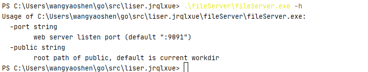

# fileServer
集群文件服务器软件

- [fileServer](#fileserver)
  * [运行环境](#----)
    + [硬件](#--)
    + [支持软件](#----)
    + [系统平台](#----)
  * [使用说明](#----)
    + [安装依赖](#----)
    + [下载软件源码](#------)
    + [编译软件](#----)
    + [启动Web服务](#--web--)
    + [额外参数说明](#------)
    + [下载功能](#----)
    + [附加功能](#----)
    + [出错与恢复](#-----)
  * [运行说明](#----)
    + [运行表与运行步骤](#--------)
  * [运行程序文件和数据文件一览表说明](#----------------)

## 运行环境
### 硬件
CPU 1核，内存200M（不包括系统本身的运行消耗）

### 支持软件
Go 1.3以上版本（编译需要，编译后的二进制软件可直接运行不需要其他依赖）

### 系统平台
因为Go语言具有跨平台编译支持，而软件本身没有依赖特定系统平台的库文件，所以Windows、Linux、MacOS理论上均支持。
目前已测试的系统平台有Windows10 和Linux 2.6.32

## 使用说明
### 安装依赖
因为编译需求，需要安装Go 1.3以上版本（以下版本也可以，只是依赖包管理需要自己配置处理，并关闭go mod模式）
安装方式如下：
1. 去[golang官方网站](https://golang.org/dl/)下载对应系统的软件压缩包（解压可直接使用）

2. 安装golang软件
    1. Windows下直接双击msi包安装
    2. Linux下直接解压tar.gz包
    3. 配置好GOROOT、GOPATH等环境变量，并将go添加如PATH查找环境
    4. go env -w GO111MODULE="on" 开启go mod
    5. 详情参考[官网指导说明](https://golang.org/doc/install)
3. 测试安装成功
命令行下`go version`测试安装成功并查看go 版本

 

### 下载软件源码
1.	使用git下载源码（需安装git）
`git clone https://github.com/liserjrqlxue/fileServer.git`

 
2.	直接解压源码

### 编译软件
进入源码目录后通过go build编译软件，保持联网状态自动下载依赖包
或者直接受用源码包内已编译好的软件：`fileServer.exe`（Windows）或`fileServer`（Linux）

### 启动Web服务
因为web服务需要的额外配置文件已写入相对路径，所以只需要保证软件与源码包内其他内容相对位置不变，可以在任意位置启动，运行源码包内`fileServer.exe`（Windows）或`fileServer`（Linux）

 

### 额外参数说明
fileServer有两个参数：

 
1.	`-port`，控制服务使用的端口号，默认:9091端口，对用服务网址为 http://IP:9091 ，其中IP为服务器的IP，如果是本机测试，也可以用http://localhost:9091/ 和http://127.0.0.1:9091/ ，如果9091端口被占用或因其他原因需要使用其他端口，通过`-port`指定，服务网址对应变更
2.	`-public`，控制服务开放的路径根目录，以此为根的后续子目录和文件都是可以通过该服务访问的，默认为运行（启动）`fileServer`的当前目录

### 下载功能
以本机服务为例，使用默认参数，启动路径为`C:\Users\wangyaoshen\go\src\liser.jrqlxue`，测试用网址为http://localhost:9091/ ，实际使用请按实际情况替换IP和端口号。
用网页浏览器打开上述网址，网页页面列出当前根目录对应服务器启动目录（`-public`控制修改）内的文件和文件夹列表：

 
可以直接点击链接下载当前目录内的文件`RDMO.7z`和`RDMO.tar.gz`，也可以点击目录链接进入子目录，然后重复进入子目录操作或者文件下载操作

 
（注：示例中`main.go`没有直接下载而是作为文件直接在浏览器中展示，这个是不同浏览器设置差异，实际是已经下载下来了）

### 附加功能
`fileServer`包含两个附加功能（非软件目的必须功能），分别是文件上传功能与视频浏览器播放功能。
1.	文件上传功能在`/upload`实现，示例网址为http://localhost:9091/upload （注意跟http://localhost:9091/upload/ 不一样），如下图，选择文件，点击`upload`按钮，上传到默认文件夹（`-public`的子文件夹`upload`）内

  
服务器会先创建`upload`子文件夹，然后把测试文件上传到`upload`子文件夹内
  
 
2.	视频浏览器播放功能可以直接播放服务器内视频而不用下载（需要浏览器支持），将视频的相对路径作为参数提交给http://localhost:9091/mp4 ，如http://localhost:9091/fileServer/public/全外解读软件缩小版.mov 可以直接下载该视频，也可以通过http://localhost:9091/mp4?file=fileServer/public/全外解读软件缩小版.mov 直接观看视频
  
 
### 出错与恢复
1.	报类似`listen tcp :9091: bind: Only one usage of each socket address (protocol/network address/port) is normally permitted. []`的错误，是端口已被占用，用-port指定新的未被占用的端口即可

 
2.	其他异常，请检查网络连接、防火墙设置等网络问题后重启
3.	如无法解决请提报[github issue](../../issues)

## 运行说明
### 运行表与运行步骤
```shell script
./fileServer <-port 要使用的端口号，默认:9091> <-public 要开放下载的路径，默认当前运行路径>
```
  

## 运行程序文件和数据文件一览表说明
序号|文件路径|说明
----|-------|----
1	|`fileserver`|	linux使用程序文件（可编译获得）
2	|`fileserver.exe`|	windows使用程序文件（可编译获得）
3	|`go.mod`|	go mod配置文件（编译需要）
4	|`go.sum`|	go mod配置文件（编译需要）
5	|`LICENSE`|	软件许可
6	|`README.md`|	软件说明
7	|`main.go`|	主程序源码（编译需要）
8	|`router/router.go`|	路由器源码（编译需要）
9	|`template/mp4play.html`|	浏览器播放视频网页模板（播放视频需要）
10	|`template/upload.html`|	上传文件网页模板（上传需要）
11	|`static/images/*.png`|	README.md需要的截图


